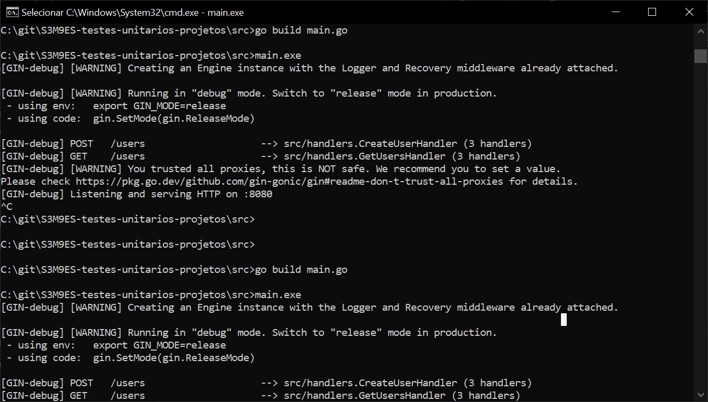
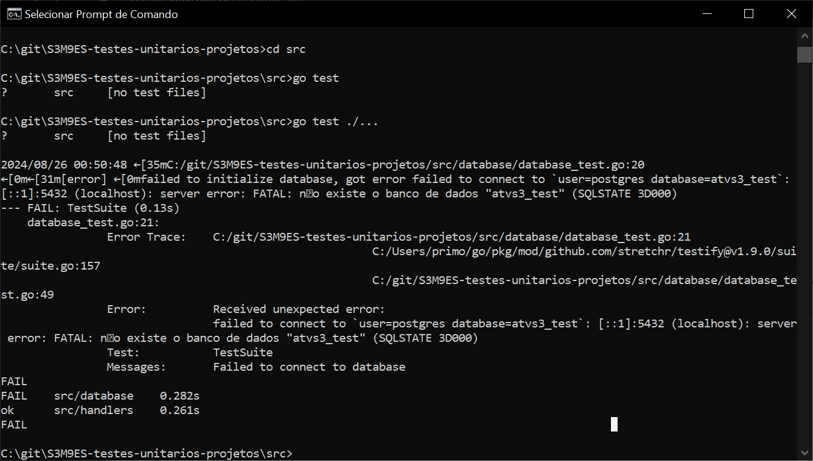
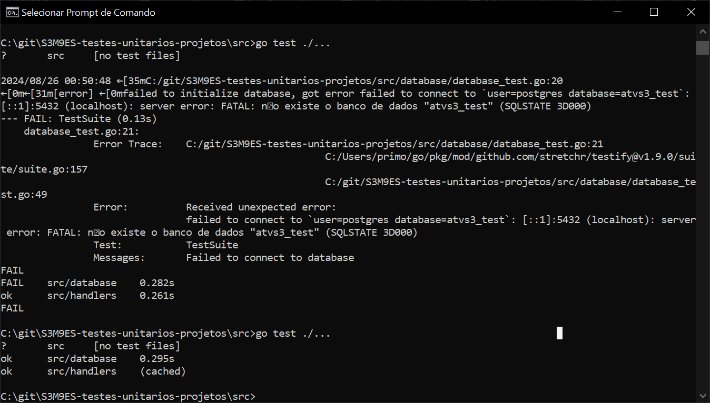

# Testes unitarios em projeto GO
## Introdução
Criei uma API em Go que faz chamadas em um banco de dados Postgres. A documentação em relação ao TDD está nos códigos de teste [database_test.go](./src/database/database_test.go) e [handler_test.go](./src/handlers/handler_test.go).

## Prints de execução
### 1. Servidor iniciado

### 2. Teste concluído com erros

### 3. Após algumas correções, o código foi concluído sem erros

Atividade de programação baseada no artigo https://dev.to/nileshprasad137/effective-unit-testing-in-a-golang-project-with-gin-gorm-and-postgresql-1ld5
